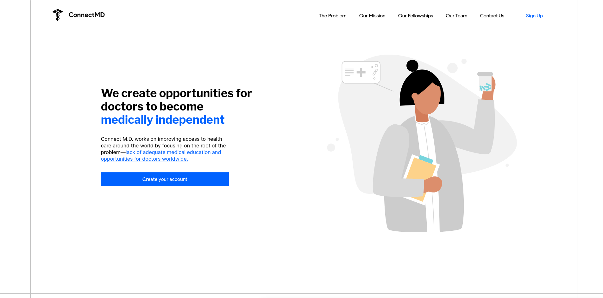

# ConnectMD

ConnectMD is an online platform with the primary and express purpose to provide healthcare education online through video and content sharing.



## Installation

Close this repository from the [upstream repository](https://github.com/kosinw/connectmd) on GitHub.

Install this repositories dependencies using your package manager of choice (either `yarn` or `npm`).

```bash
# Install this repositories dependencies...
npm install

# Or if you prefer to use yarn...
yarn install
```

## Development

```bash
# To start the backend development server...
yarn dev:server

# To start the website development server...
yarn dev:web

# To start BOTH the website and backend development servers...
yarn dev
```

## Building

```bash
# Building the backend module...
yarn build:server
```

## Contributing
This repository follows the [gitflow workflow](https://github.com/kosinw/connectmd) for creating branches. In addition, we use [semantic versioning](https://semver.org/) for release versioning and [conventional commits](https://www.conventionalcommits.org/en/v1.0.0/). Before contributing to this project please make sure you familiarize yourself with these technologies.

Pull requests are welcome. For major changes, please open an issue first to discuss what you would like to change. Note, that pull requests and issues are at the total discretion of the maintainer and will be rejected if they do not follow the [contributing guidelines](##Contributing).

Please make sure to update tests as appropriate.

## License
[Creative Commons NC-ND 4.0 International](LICENSE.md)